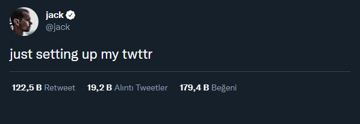
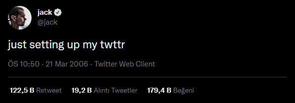
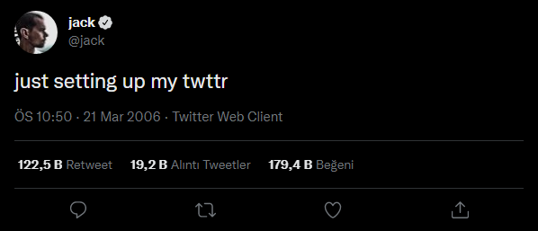

# TweetCapture

Easily take screenshots of tweets/mentions and save them as image.

## Command-Line Usage

```
> pip install tweet-capture
> tweetcapture https://twitter.com/jack/status/20
> tweetcapture -h
```

## Code Usage Examples

- [Cli](tweetcapture/cli.py)
- [Code Examples](tweetcapture/examples/)

## Testing
```
> cd tweetcapture/tests/
> python -m unittest
```

## Modes

| #   |                                                   |                                                      |
| --- | ------------------------------------------------- | ---------------------------------------------------- |
| 0   | Hide everything outside tweet content and author. |  |
| 1   | Show retweet/like counts.                         |  |
| 2   | Show retweet/like counts and timestamp.           |  |
| 3   | Show everything.                                  |  |
| 4   | Show timestamp.                                   |  |

## Night Modes

| #   |            |                                                      |
| --- | ---------- | ---------------------------------------------------- |
| 0   | Light mode |  |
| 1   | Dark mode  |  |
| 2   | Black mode |  |

## Show Mentions Example
_If the tweet have a very many mentions, there may be problems because "show more" option not supported. The tool can show only first loaded mentions. You can limit mention count on screenshot by using -sc <count> argument_
```
tweetcapture -sm 3 https://twitter.com/Twitter/status/1445078208190291973
```
<details>
    <summary>Image</summary>
    
</details>

## Show Parent Tweets Example
```
tweetcapture -sp https://twitter.com/elonmusk/status/1587911540770222081
```
<details>
    <summary>Image</summary>
    
</details>
